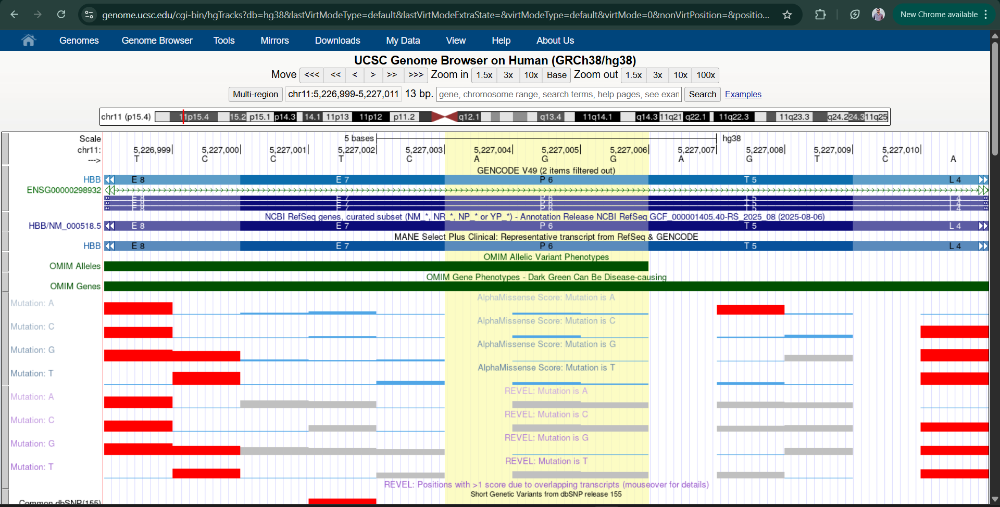
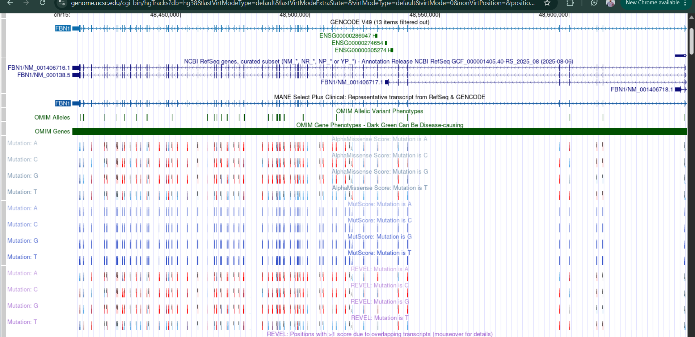

# genetic-disorders-clinvar-assignment
 ClinVar variant analysis for Cystic Fibrosis, Sickle Cell Disease, and Marfan Syndrome
# Genetic Disorders ClinVar Analysis - Assignment #2

## 📋 Overview
This repository contains the complete analysis of three genetic disorders using ClinVar, OMIM, and UCSC Genome Browser data as part of Assignment #2.

## 🧬 Selected Disorders
1. **Cystic Fibrosis** - CFTR gene (p.Phe508del)
2. **Sickle Cell Disease** - HBB gene (p.Glu6Val)
3. **Marfan Syndrome** - FBN1 gene (p.Cys1039Gly)

## 📁 Repository Structure
├── README.md # This documentation
├── patient_variants.vcf # VCF file with patient variants
├── Assignment_2_Completed.xlsx # Completed Excel sheet
├── screenshots/
│ ├── UCSC_Alphamissense_HBB.png
│ ├── UCSC_Alphamissense_FBN1.png
│ ├── UCSC_RAVEL_HBB.png
│ └── UCSC_RAVEL_FBN1.png
└── references/
├── clinvar_annotations.txt
└── omim_phenotypes.txt

## 📊 Data Sources

### ClinVar Variants
| Disorder | Variant | ClinVar Significance |
|----------|---------|---------------------|
| Cystic Fibrosis | NM_000492.3(CFTR):c.1521_1523delCTT (p.Phe508del) | Pathogenic |
| Sickle Cell Disease | NM_000518.5(HBB):c.20A>T (p.Glu6Val) | Pathogenic |
| Marfan Syndrome | NM_000138.4(FBN1):c.3115T>G (p.Cys1039Gly) | Pathogenic |

### OMIM Phenotype Links
- [Cystic Fibrosis (OMIM: 219700)](https://www.omim.org/entry/219700)
- [Sickle Cell Disease (OMIM: 603903)](https://www.omim.org/entry/603903)
- [Marfan Syndrome (OMIM: 154700)](https://www.omim.org/entry/154700)

### UCSC Genome Browser Tracks
- **Alphamissense**: Pathogenicity predictions for missense variants
- **RAVEL**: Pathogenicity classification scores

## 🧪 ACMG/AMP Classifications

| Variant | ACMG Criteria | Classification |
|---------|--------------|----------------|
| CFTR p.Phe508del | PVS1, PS3, PM2, PP3 | Pathogenic |
| HBB p.Glu6Val | PS1, PS3, PM2, PP3 | Pathogenic |
| FBN1 p.Cys1039Gly | PM1, PM2, PP3, PS4 | Pathogenic |

## 🔬 VCF File
The `patient_variants.vcf` file contains the three variants in standard VCF format (GRCh38/hg38 assembly) suitable for ClinVar annotation.

## 📸 Screenshots

### HBB Gene (Sickle Cell Disease)

### FBN1 Gene (Marfan Syndrome)

## ✅ Steps to Reproduce

### 1. ClinVar Search
- Visit [ClinVar](https://www.ncbi.nlm.nih.gov/clinvar/)
- Search for each variant using HGVS notation
- Record classification and review status

### 2. OMIM Phenotype Search
- Visit [OMIM](https://www.omim.org/)
- Search by gene or disorder
- Document phenotype characteristics

### 3. UCSC Genome Browser
- Go to [UCSC Genome Browser](https://genome.ucsc.edu)
- Select human assembly GRCh38/hg38
- Search for each gene
- Enable "Alphamissense" and "RAVEL" tracks
- Capture screenshots

### 4. ACMG/AMP Classification
- Apply ACMG guidelines to each variant
- Document criteria used

### 5. VCF Creation
- Format variants in VCF 4.2 format
- Include proper header and annotations

## 📝 Assignment Requirements Met
- ✅ Selected 3 genetic disorders
- ✅ ClinVar variant details
- ✅ OMIM phenotype information
- ✅ UCSC Alphamissense screenshots
- ✅ UCSC RAVEL screenshots
- ✅ ACMG/AMP classifications
- ✅ VCF file generation
- ✅ GitHub repository with documentation

## 👤 Author
Muhammad Hamza Najeem

## 📅 Date
March 1, 2026

## 📚 References
1. ClinVar. National Center for Biotechnology Information. https://www.ncbi.nlm.nih.gov/clinvar/
2. OMIM. Johns Hopkins University. https://www.omim.org/
3. UCSC Genome Browser. University of California Santa Cruz. https://genome.ucsc.edu/
4. Richards S, et al. Standards and guidelines for the interpretation of sequence variants. Genet Med. 2015.
